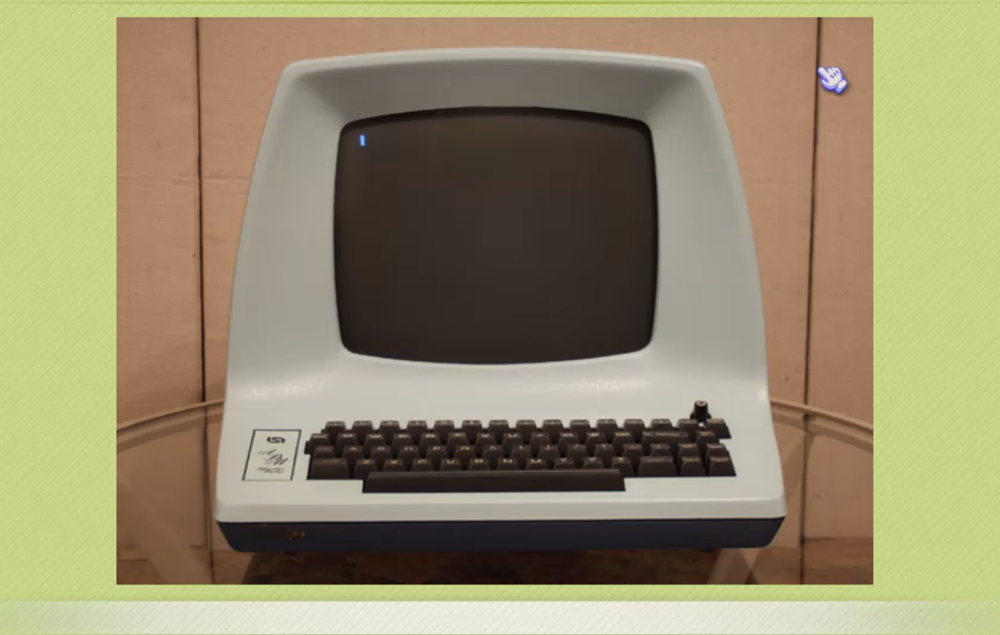
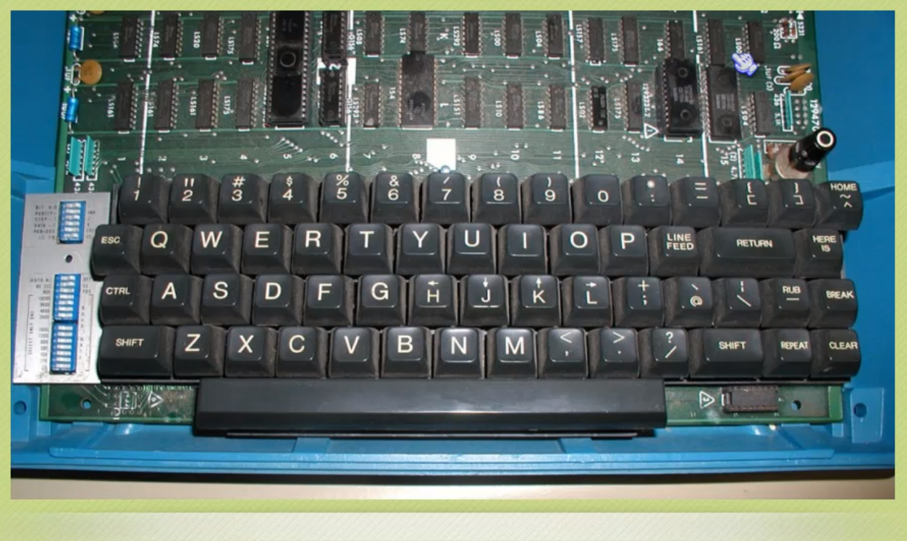

# Vim

## Vim 快速入门（小甲鱼）

> + 第一节： 用 `h j k l` 来移动你的光标
>> 1. 为什么使用 `h j k l`移动光
>>
>> 
>>
>> 

> + 第二节： 插入模式和退出 `VIM` 的方法
>> 1. `VIM` 支持多种模式，并且运行在多种模式见任意切换

>> 2. 六种基本模式
>>> + 普通模式
>>> + 插入模式
>>> + 可视模式
>>> + 选择模式
>>> + 命令行模式
>>> + Ex 模式 

>> 3. 五种派生模式
>>> - 操作符等待模式
>>> - 插入普通模式
>>> - 插入可视模式
>>> - 插入选择模式
>>> - 替换模式

>> 4. 普通模式
>>> 1. 使用 `VIM` 打开文件默认进入**普通模式**，普通模式下可以使用按键移动光标、保存/退出文件等
>>> 2. 按下 `Esc` 键退出其他模式，进入普通模式

>> 5. 插入模式
>>> 1. `i` **在光标前边进入插入模式**
>>> 2. `I` **在光标所在行的行首进入插入模式**
>>> 3. `a` **在光标的后面进入插入模式**
>>> 4. `A` **在光标所在行的行尾进入插入模式**
>>> 5. `o` **在光标所在行下方插入空行并进入插入模式**
>>> 6. `O` **在光标所在行的上方插入空行并进入插入模式**
>>> 7. `s` **删除光标所指定的字符并进入插入模式**
>>> 8. `S` **清楚光标所在行并进入插入模式**

> + 第三节： 删除命令、数字的奥义、撤销和恢复命令
> + 第四节： 粘贴命令、替换命令、替换模式和修改命令
> + 第五节： 文件信息、跳转和定位括号
> + 第六节： 搜索命令和替换命令
> + 第七节： 执行 `shell` 命令、文件另存为和合并文件